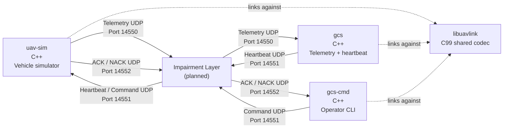

# UAV Ground Control System Architecture

## Overview

The system consists of four primary components:

1. **`uav-sim`** — Simulated air vehicle and flight-mode state machine.
2. **`gcs`** — Always-running ground station responsible for telemetry reception, processing, recording, health monitoring, and ground-station heartbeat transmission.
3. **`gcs-cmd`** — Operator-facing command-line application responsible for sending commands and handling command acknowledgments and retries.
4. **`libuavlink`** — Shared C99 protocol library providing encoding, decoding, framing, CRC, and protocol validation.

An impairment layer will be introduced in a later phase between the UDP endpoints to simulate packet loss, delay, duplication, and reordering.

## Architecture

## Network Interfaces

| Flow       | Source    | Destination | Transport |    Port | Purpose                  |
| ---------- | --------- | ----------- | --------- | ------: | ------------------------ |
| Telemetry  | `uav-sim` | `gcs`       | UDP       | `14550` | Continuous vehicle state |
| Heartbeat  | `gcs`     | `uav-sim`   | UDP       | `14551` | Ground-station liveness  |
| Commands   | `gcs-cmd` | `uav-sim`   | UDP       | `14551` | Operator commands        |
| ACK / NACK | `uav-sim` | `gcs-cmd`   | UDP       | `14552` | Command responses        |

`gcs` and `gcs-cmd` therefore both transmit to the vehicle's command port, `14551`. The vehicle distinguishes heartbeat and command messages using the protocol message type rather than using separate UDP ports.

## Why UDP for Telemetry?

Telemetry uses UDP because it is continuous and its value decreases rapidly with age. The simulator produces telemetry at `50 Hz`, so when a packet is lost, newer packets normally contain more useful vehicle state by the time the missing packet could be retransmitted.

TCP would retransmit missing data and preserve ordering, potentially causing newer telemetry to wait behind an old packet through head-of-line blocking. UDP allows the GCS to continue receiving current telemetry while sequence numbers expose packet loss, reordering, and duplication. This matches the project's model of an unreliable link where packet loss, latency, and complete dropouts are expected.

## Why Does the Command Path Need Reliability?

Commands have fundamentally different semantics from telemetry. A telemetry packet describing vehicle state at time `T` becomes stale as newer packets arrive, but a command such as `RTL` remains important even if it is delayed. Losing a command can therefore leave the vehicle in an unintended state.

The command path consequently implements application-level reliability using sequence numbers, acknowledgments, timeouts, and bounded retries. `gcs-cmd` retransmits an unacknowledged command after `750 ms` and gives up after `3` attempts. The vehicle uses the session identifier and sequence number to recognize retries and prevent a state-changing command from executing twice.

## Ground-Station Heartbeat and Lost-Link Detection

The ground station heartbeat solves an important distinction: **no command is not the same thing as no ground connection**. Commands are sporadic and operator-driven, so the vehicle cannot infer link loss from the absence of commands. The always-running `gcs` process therefore transmits a heartbeat at `1 Hz`, independently of operator commands. `uav-sim` enters `RTL` after `3,000 ms` without a valid heartbeat while in `ARMED`, `AUTO`, or `RTL`.

`gcs-cmd` does not own the heartbeat because it is an operator-facing process that can be started and stopped independently of the continuously running ground station. Keeping heartbeat generation in `gcs` means the heartbeat represents the availability of the ground station rather than the presence of an active command session.

Because `gcs` and `gcs-cmd` both transmit to the same vehicle UDP port, the protocol message type distinguishes heartbeat messages from command messages. Both processes use `libuavlink`, ensuring that the vehicle receives the same framing, versioning, byte order, and CRC rules regardless of which ground process generated the packet.

## Why Is `libuavlink` a Shared Library?

`libuavlink` is shared by `uav-sim`, `gcs`, and `gcs-cmd` because all three programs must agree on exactly the same wire format. The library owns encoding, decoding, framing, CRC calculation, byte order, and protocol validation.

Duplicating this logic would create multiple implementations of the protocol that could diverge over time. A single shared implementation instead makes the protocol an explicit interface contract between the components. It is also deliberately implemented as C99 without dynamic allocation, sockets, or operating-system dependencies, allowing the codec to remain portable to constrained targets.

## Component Responsibilities

### `uav-sim`

`uav-sim` represents the air vehicle. Its fixed-rate `50 Hz` cyclic executive advances vehicle state, processes incoming commands, evaluates the flight-mode state machine, evaluates failsafe conditions, and emits telemetry. The simulator is intentionally not a flight-dynamics model; its purpose is to generate plausible vehicle behavior and exercise the ground-system software.

### `gcs`

`gcs` is the continuously running ground station. It receives telemetry, validates and decodes packets, detects loss/reordering/duplication, checks vehicle state against operational limits, records telemetry, maintains health counters, and transmits the `1 Hz` ground-station heartbeat.

### `gcs-cmd`

`gcs-cmd` is the operator-facing command interface. It creates a command session, assigns sequence numbers, sends commands, waits for ACK/NACK responses, retries commands after `750 ms`, and reports failure after `3` attempts. It is intentionally separate from `gcs` so the continuously running ground-station services do not depend on the lifetime of an individual operator command process.

### `libuavlink`

`libuavlink` contains only protocol functionality: encoding, decoding, framing, CRC, byte-order handling, and validation. It has no socket or operating-system responsibilities, keeping the wire-format contract independent from the transport and application layers.

### Impairment Layer

The impairment layer is a planned component that will sit between the UDP endpoints. It will provide controlled simulation of packet loss, latency, duplication, and reordering so that the failure-handling requirements can be tested under repeatable network conditions.
